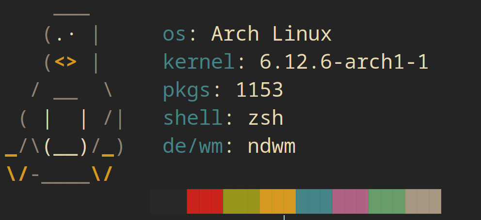
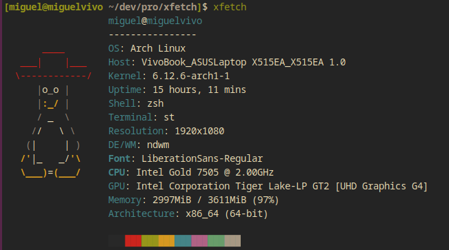

<p align="center"></p>

<h4 align="center">Simple and minimal system fetching tool</h4>

<p align="center">
xfetch is a command-line tool written in POSIX Shell that displays the system information in a clean and beautiful way
</p>

<p align="center">

</p>

## Dependencies

- GNU Make

## Installation

```
sudo make install
```

By default, the program is installed under `/usr/local/bin`.

## Usage

### Default

```
xfetch
```



### Petit

```
xfetch -p
```


## FAQ

### Q: Neofetch is good enough. Why do I need xfetch?

1. xfetch is actively maintained.
2. xfetch is so simple that anyone can read the source code, understand it, extend it, fork it, etc.
3. xfetch is actually faster.
4. xfetch is a POSIX compliant shell script.

### Q: It doesn't work on my system. Why?

I'm stil testing the program in different systems, but it should work on any Linux distro with a POSIX compliant shell.